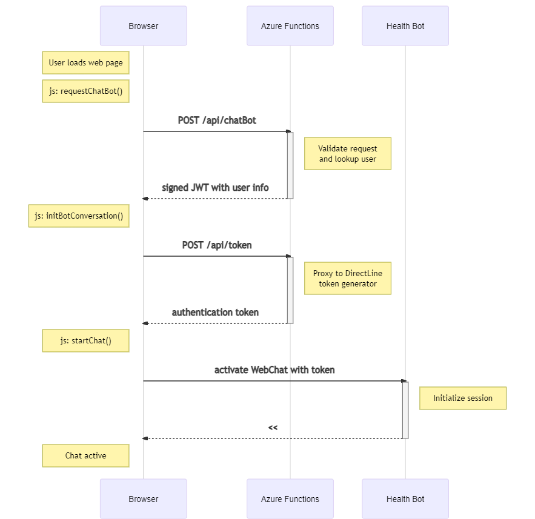

# Health Bot Static Web App

A simple web page that allows users to communicate with the [Microsoft Healthcare Bot service](https://www.microsoft.com/en-us/research/project/health-bot/) through the WebChat channel. To simplify the deployment, [Azure Static Web Apps](https://docs.microsoft.com/en-us/azure/static-web-apps/overview) are used to host both the web page and the required serverless backend.

## Getting Started

1. Fork this repository on github

2. If you don't already have one, create an Azure Health Bot using this [quickstart](https://docs.microsoft.com/en-us/healthbot/quickstart-createyourhealthcarebot).

3. Create an Azure Static Web App

    You can create the Static Web App in a `<RESOURCE_GROUP_NAME>` and `<LOCATION>`, but it is recommended to create it in the same place as your Azure Health Bot.

    As described in the [documentation](https://docs.microsoft.com/en-us/azure/static-web-apps/get-started-cli?tabs=vanilla-javascript#create-a-static-web-app), you can create the Static Web App with the [portal](https://docs.microsoft.com/en-us/azure/static-web-apps/get-started-portal?tabs=vanilla-javascript#create-a-static-web-app) or the command line:

    ```bash
    az staticwebapp create \
        -n health-bot-static-web-app \
        -g <RESOURCE_GROUP_NAME> \
        -s https://github.com/<YOUR_GITHUB_ACCOUNT_NAME>/HealthBotStaticWebAppSample \
        -l <LOCATION> \
        -b master \
        --token <YOUR_GITHUB_PERSONAL_ACCESS_TOKEN>
    ```

4. Connect the Web Chat with your Azure Health Bot

    a. You will need two secrets from your Azure Health Bot Management portal to connect the Web Chat with the Health Bot service. You will need the `APP_SECRET` and `WEBCHAT_SECRET` which can be found under `Integration > Secrets` in the left hand navigation panel.

    

    b. You can configure your Static Web App with these two secrets from the Azure Portal (under Configuration, click `+ Add` and enter the two secrets) or from the command line:

    ```bash
    az staticwebapp appsettings set \
        -n health-bot-static-web-app \
        -g <RESOURCE_GROUP_NAME>
        --setting-names \
          APP_SECRET=<INSERT_APP_SECRET_HERE> \
          WEBCHAT_SECRET=<INSERT_WEBCHAT_SECRET_HERE>
    ```
5. Use the Azure Portal to navigate to your Static Web App. You should see a simple chat interface with which you can interact with your Azure Health Bot. Use the `begin <scenario_id>` syntax to launch one of your bot scenarios directly.

## How it works

There are three main components in this example: the web client, a small serverless component, and the Azure Health Bot itself. Both the web client and the serverless components are deployed and configured via Azure Static Web Apps via a GitHub Action. This sequence diagram captures the high-level interaction between all three components.



### Web Client

The web client runs in locally in your browser and is hosted as a static web page in Azure. It consists of three files:

| filename               | description                                             |
|------------------------|---------------------------------------------------------|
| /index.html            | a simple HTML page to host the WebChat user interface   |
| /index.js              | javascript code used to connect to the Azure Health Bot |
| /stylesheets/style.css | simple styling for the user interface                   |

### Serverless Functions

There are two serverless components deployed to coordinate the authentication of the web client to the bot:

| component                   | description                                                 |
|-----------------------------|-------------------------------------------------------------|
| Function @ /api/chatBot     | returns user information to the web client (can be used for authorization checks)   |
| Function Proxy @ /api/token | uses the WebChat secret to retrieve an authentication token |

### Health Bot

The Azure Health Bot is configured independently of this project as described in step 2 above.

## Dev Notes

- With the exception of the Azure Health Bot, this example can be run locally. Use the [Live Server](https://marketplace.visualstudio.com/items?itemName=ritwickdey.LiveServer) extension for VS Code to host the web pages locally and the [Azure Functions Core Tools](https://docs.microsoft.com/en-us/azure/azure-functions/functions-run-local) to host the serverless components.

## Notes

In some cases it is required to set the endpoint URI so that it points to a specific geography. The geographies supported by the bot service each have a unique direct line endpoint URI:

- `directline.botframework.com` routes your client to the nearest datacenter. This is the best option if you do not know where your client is located.
- `asia.directline.botframework.com` routes only to Direct Line servers in Eastern Asia.
- `europe.directline.botframework.com` routes only to Direct Line servers in Europe.
- `northamerica.directline.botframework.com` routes only to Direct Line servers in North America.

This project uses `directline.botframework.com` by default. If you need to change this behavior, modify `"backendUri"` property in the [/api/proxies.json](https://github.com/jmutchek-msft/HealthBotStaticWebAppSample/blob/master/api/proxies.json) file.
