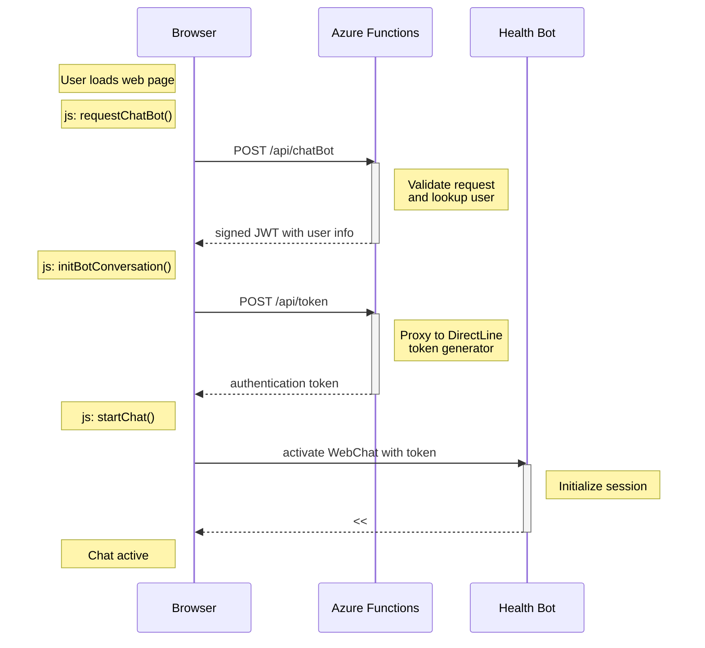

```mermaid
sequenceDiagram
    participant B as Browser
    participant F as Azure Functions
    participant H as Health Bot

    note left of B: User loads web page
    note left of B: js: requestChatBot()
    B->>F:POST /api/chatBot
    activate F
    note right of F: Validate request <br/>and lookup user
    F-->>B: signed JWT with user info
    deactivate F

    note left of B: js: initBotConversation()
    B->>F: POST /api/token    
    activate F
    note right of F: Proxy to DirectLine <br/> token generator
    F-->>B: authentication token
    deactivate F

    note left of B: js: startChat()
    B->>H: activate WebChat with token
    activate H
    note right of H: Initialize session
    H-->>B: <<
    deactivate H
    note left of B: Chat active
```