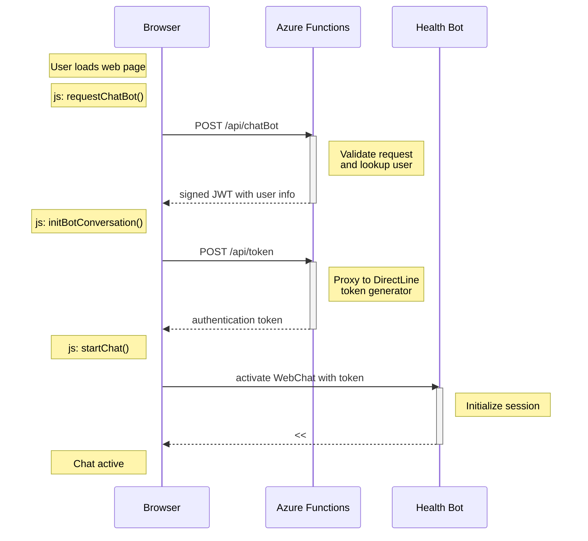

# Mermaid Sequence Diagram

Github's markdown rendering engine does not support direct rendering of mermaid diagrams. Use the [Mermaid Live Editor](https://mermaid-js.github.io/mermaid-live-editor/#/edit/eyJjb2RlIjoic2VxdWVuY2VEaWFncmFtXG4gICAgcGFydGljaXBhbnQgQiBhcyBCcm93c2VyXG4gICAgcGFydGljaXBhbnQgRiBhcyBBenVyZSBGdW5jdGlvbnNcbiAgICBwYXJ0aWNpcGFudCBIIGFzIEhlYWx0aCBCb3RcblxuICAgIG5vdGUgbGVmdCBvZiBCOiBVc2VyIGxvYWRzIHdlYiBwYWdlXG4gICAgbm90ZSBsZWZ0IG9mIEI6IGpzOiByZXF1ZXN0Q2hhdEJvdCgpXG4gICAgQi0-PkY6UE9TVCAvYXBpL2NoYXRCb3RcbiAgICBhY3RpdmF0ZSBGXG4gICAgbm90ZSByaWdodCBvZiBGOiBWYWxpZGF0ZSByZXF1ZXN0IDxici8-YW5kIGxvb2t1cCB1c2VyXG4gICAgRi0tPj5COiBzaWduZWQgSldUIHdpdGggdXNlciBpbmZvXG4gICAgZGVhY3RpdmF0ZSBGXG5cbiAgICBub3RlIGxlZnQgb2YgQjoganM6IGluaXRCb3RDb252ZXJzYXRpb24oKVxuICAgIEItPj5GOiBQT1NUIC9hcGkvdG9rZW4gICAgXG4gICAgYWN0aXZhdGUgRlxuICAgIG5vdGUgcmlnaHQgb2YgRjogUHJveHkgdG8gRGlyZWN0TGluZSA8YnIvPiB0b2tlbiBnZW5lcmF0b3JcbiAgICBGLS0-PkI6IGF1dGhlbnRpY2F0aW9uIHRva2VuXG4gICAgZGVhY3RpdmF0ZSBGXG5cbiAgICBub3RlIGxlZnQgb2YgQjoganM6IHN0YXJ0Q2hhdCgpXG4gICAgQi0-Pkg6IGFjdGl2YXRlIFdlYkNoYXQgd2l0aCB0b2tlblxuICAgIGFjdGl2YXRlIEhcbiAgICBub3RlIHJpZ2h0IG9mIEg6IEluaXRpYWxpemUgc2Vzc2lvblxuICAgIEgtLT4-QjogPDxcbiAgICBkZWFjdGl2YXRlIEhcbiAgICBub3RlIGxlZnQgb2YgQjogQ2hhdCBhY3RpdmUiLCJtZXJtYWlkIjp7InRoZW1lIjoiZGVmYXVsdCJ9LCJ1cGRhdGVFZGl0b3IiOmZhbHNlfQ) to make changes to the diagram and update the `/docs/sequence.png` file as necessary.

